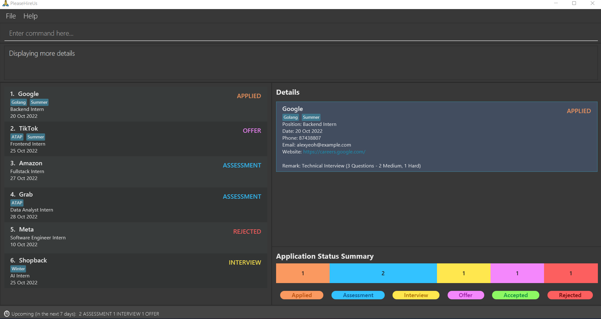
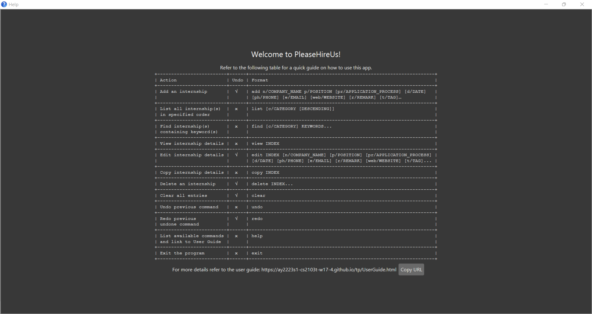

PleaseHireUs (PHU) is a **desktop app for managing internships for computer science students 
optimized for use via a Command Line Interface** (CLI) while still having the benefits of a Graphical User Interface (GUI). 
If you can type fast, PHU can manage your internship details done faster than traditional GUI apps.

* Table of Contents
  {:toc}

--------------------------------------------------------------------------------------------------------------------

## Quick start

1. Ensure you have Java `11` or above installed in your Computer.

1. Download the latest `PleaseHireUs.jar` from [here](https://github.com/AY2223S1-CS2103T-W17-4/tp/releases).

1. Copy the file to the folder you want to use as the _home folder_ for your application.

1. Double-click the file to start the app. The GUI similar to the below should appear in a few seconds. Note how the app contains some sample data. 
   

1. Type the command in the command box and press Enter to execute it. e.g. typing **`help`** and pressing Enter will open the help window. 
   Some example commands you can try:

   * **`list`** : Lists all internships.

   * **`add n/Grab p/software engineer pr/ASSESSMENT web/https://www.grab.com/sg/about`** : Adds a new internship to the internship tracker.

   * **`delete 3`** : Deletes the 3rd internship shown in the current list.

   * **`clear`** : Deletes all internships.

   * **`exit`** : Exits the app.

1. Refer to the [Features](#features) below for details of each command.

--------------------------------------------------------------------------------------------------------------------

## Features

**:information_source: Notes about the command format:** 

* Words in `UPPER_CASE` are the parameters to be supplied by the user. 
  e.g. in `add n/COMPANY_NAME`, `COMPANY_NAME` is a parameter which can be used as `add n/Grab`.

* Items in square brackets are optional. 
  e.g `n/COMPANY_NAME [t/TAG]` can be used as `n/Jane Street t/$$$` or as `n/Jane Street`.

* Items with `…`​ after them can be used multiple times including zero times. 
  e.g. `[t/TAG]…​` can be used as ` ` (i.e. 0 times), `t/$$$`, `t/free lunch t/transport` etc.

* Parameters can be in any order. 
  e.g. if the command specifies `n/COMPANY_NAME pr/APPLICATION_PROCESS`, `pr/APPLICATION_PROCESS n/COMPANY_NAME` is also acceptable.

* If a parameter is expected only once in the command but you specified it multiple times, only the last occurrence of the parameter will be taken. 
  e.g. if you specify `n/Bytedance n/Tiktok`, only `n/Tiktok` will be taken.

* Extraneous parameters for commands that do not take in parameters (such as `help`, `exit` and `clear`) will be ignored. 
  e.g. if the command specifies `help 123`, it will be interpreted as `help`.

### Viewing help : `help`

Shows a message explaning how to access the help page.

Format: `help`

### Adding an internship: `add`

Adds an internship into the list.

Format: `add n/COMPANY_NAME p/POSITION [pr/APPLICATION_PROCESS] [d/DATE] [web/WEBSITE]`

* Possible options for `APPLICATION_PROCESS` : `APPLY`, `ASSESSMENT`, `INTERVIEW`, `OFFER`, `ACCEPTED`, `REJECTED` 
* Case-insensitive: `Apply`, `APPLY`, and `apply` are all acceptable inputs.
* `DATE` should be in dd-mm-yyyy format.
* `DATE` will be set to today’s date by default.
* `APPLICATION_PROCESS` will be set to `APPLY` by default.
* `WEBSITE` will be set to “NA” by default.

Examples:
* `add n/Grab p/software engineer pr/ASSESSMENT web/https://www.grab.com/sg/about`
* `add n/Tiktok p/backend engineer`
* `add n/Shopee p/frontend engineer pr/INTERVIEW d/14-09-2022`

### Listing all internships : `list`

Shows a list of all internships. List of internships can be sorted by category in ascending or descending order.

Format: `list [c/CATEGORY] [REVERSE]`
* List the internships sorted by category and in ascending or descending order
* The category is optional. By default, without stating the category, `list` will display all internships in no particular order
* The CATEGORY tag refers to company_name (or n), position (or p), application_process (or pr), website (or web), date(or d) (case-insensitive)
* The reverse tag is optional. It can take on the value `true` or `false`. The reverse tag is set to false by default if not stated. List of internships will be shown in ascending order.
* If REVERSE is set to `true`. List of internships will be displayed in descending order

Examples:
* `list c/n true`
* `list c/website true`
* `list c/position false`

### Locating internships by: `find`

Find internships whose data in the target category matched the given keyword/s.

Format: `find [c/CATEGORY] KEYWORDS…`

* The search is case-insensitive. e.g `hans` will match `Hans`
* The order of the keywords does not matter. e.g. `Hans Bo` will match `Bo Hans`
* The `CATEGORY` tag refers to company_name (or n), position (or p), application_process (or pr), tags (or t), date (or d) (case-insensitive)
* If not specified, the `CATEGORY` tag will be set to company_name as a default
* Only the target category is searched.
* A `KEYWORD` will match any string if the `KEYWORD` is contained in that string e.g. `Han` will match both `Reyhan` and `Handy`
* Internships whose target category match at least one keyword will be returned (i.e. OR search). e.g. `c/company_name Hans Bo` can return internships with company name of `Hans Gruber` or `Bo Yang`
* For the find by date category, all `KEYWORD` must be a valid date in `dd-mm-yyyy` format

Examples:
* `find c/p engineer` returns a list of internships with a position of Algorithm Engineer and Software Engineer
* `find sea shop` returns a list of internships with company name of Sea Labs, Shopee, and Shopback

### Deleting internship(s) : `delete`

Deletes the specified internship(s) from the list.

Format: `delete INDEX...`

* Deletes the internship at the specified `INDEX`.
* The index refers to the index number shown in the displayed internship list.
* The list use 1-based indexing, which means the index **must be a positive integer** such as 1, 2, 3, …​
* Can add multiple `INDEX` to delete multiple internships.

Examples:
* `list` followed by `delete 1 3` deletes the 1st and 3rd internship from the list.
* `find TikTok` followed by `delete 1` deletes the 1st internship in the results of the `find` command.

### View details of an internship: `view`

View details of list item at index

Format: `view NAME [INDEX]`

* Only the name is searched.
* Companies matching the name will be returned (i.e. OR search). 
e.g. Shopee will return Shopee, Shopee Labs as a numbered list.
* If only one company matches the name, its details will immediately be shown.
* Call the command again with the index to retrieve details about the application status at the company with corresponding index.

Examples:
* `view Shopee` returns
`1. Shopee`
`2. Shopee Labs`
* `view Shopee 1` returns `Shopee, CEO, 29/02/23, offer, NA`

### Editing internships `[coming in v1.2b]` `edit`
Edit details of an internship

### Clearing all entries : `clear`

Clears all entries from the internship tracker.

Format: `clear`

### Exiting the program : `exit`

Exits the program.

Format: `exit`

### Saving the data

PleaseHireUs data are saved in the hard disk automatically after any command that changes the data. There is no need to save manually.

### Editing the data file

PleaseHireUs data are saved as a JSON file `[JAR file location]/data/pleasehireus.json`. Advanced users are welcome to update data directly by editing that data file.

:exclamation: **Caution:**
If your changes to the data file makes its format invalid, AddressBook will discard all data and start with an empty data file at the next run.

### Archiving data files `[coming in v1.3]`

_Details coming soon ..._

--------------------------------------------------------------------------------------------------------------------

## 3. FAQ

**Q**: How do I transfer my data to another Computer? 
**A**: Install the app in the other computer and overwrite the empty data file it creates with the file that contains the data of your previous PleaseHireUs home folder.

--------------------------------------------------------------------------------------------------------------------

## 4. Command summary

Action | Format, Examples
--------|------------------
**Add** | `add n/NAME p/PHONE_NUMBER e/EMAIL a/ADDRESS [t/TAG]…​`   e.g., `add n/James Ho p/22224444 e/jamesho@example.com a/123, Clementi Rd, 1234665 t/friend t/colleague`
**Clear** | `clear`
**Delete** | `delete INDEX...`  e.g., `delete 1 3`
**Edit** | `edit INDEX [n/NAME] [p/PHONE_NUMBER] [e/EMAIL] [a/ADDRESS] [t/TAG]…​`  e.g.,`edit 2 n/James Lee e/jameslee@example.com`
**Find** | `find [c/CATEGORY] KEYWORDS...`  e.g., `find c/p engineer`
**List** | list [c/CATEGORY] [REVERSE]   e.g, `list c/website true`
**Help** | `help`
